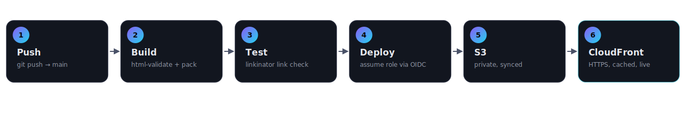

# ci-cd — Static Site, GitHub Actions → AWS

[](https://github.com/Hardikrepo/ci-cd/actions/workflows/deploy.yml)
**Live:** [d1lmh2q9zjh8hr.cloudfront.net](https://d1lmh2q9zjh8hr.cloudfront.net)

Push to `main`. Three GitHub Actions jobs run — **build**, **test**,
**deploy** — and the site is live on CloudFront a few seconds later. No AWS
access keys are stored anywhere: the deploy job trades a short-lived GitHub
OIDC token for temporary AWS credentials at run time.



## What's in this repo

```
site/                          the static site that gets deployed
  index.html                   landing page for this project
  404.html                     custom not-found page
  style.css, script.js
terraform/                     all AWS infrastructure, as code
  main.tf                      S3 bucket, CloudFront + OAC, GitHub OIDC provider, IAM role
  variables.tf, outputs.tf, provider.tf
.github/workflows/deploy.yml   the build -> test -> deploy pipeline
docs/pipeline-diagram.svg      the diagram above
```

## The pipeline

| Job | Trigger | What runs |
|---|---|---|
| **build** | every PR + every push to `main` | `html-validate` lints `site/`, then packages it into a `public/` artifact |
| **test** | every PR + every push to `main` | `linkinator` recursively checks every internal link in the built artifact |
| **deploy** | push to `main` only | assumes an AWS IAM role via OIDC, `aws s3 sync`s to the bucket, invalidates the CloudFront cache |

`deploy` never runs on a pull request — only on a push to `main`, and only
after `build` and `test` both pass.

## Architecture

```
GitHub Actions --AssumeRoleWithWebIdentity--> IAM Role --s3 sync--> S3 (private) --Origin Access Control--> CloudFront --HTTPS--> visitor
```

- **No stored AWS keys.** The `deploy` job requests a GitHub OIDC token
  (`permissions: id-token: write`) and `aws-actions/configure-aws-credentials`
  exchanges it for temporary AWS credentials via `sts:AssumeRoleWithWebIdentity`.
- **Repo + environment scoped.** The IAM role's trust policy only accepts
  tokens whose subject is exactly `repo:Hardikrepo/ci-cd:environment:production`
  — nothing else can assume it.
- **Bucket is fully private.** All public access is blocked at the bucket
  level; only CloudFront (via Origin Access Control) can read objects.
- **Everything is Terraform.** The bucket, distribution, OIDC provider, and
  IAM role/policy are all defined in `terraform/` — `terraform apply`
  reproduces the whole stack from scratch.

## Setting it up yourself

**1. Provision AWS infrastructure**

```bash
cd terraform
terraform init
terraform apply \
  -var="bucket_name=your-globally-unique-bucket-name" \
  -var="github_repository=your-org/your-repo"
```

`github_repository` must match `owner/repo` exactly. By default the trust
policy scopes to the `production` GitHub environment (see `github_environment`
in `variables.tf` to change it — this must match the `environment:` block in
the `deploy` job).

```bash
terraform output   # note bucket_name, deploy_role_arn, cloudfront_distribution_id, cloudfront_domain_name
```

**2. Set GitHub repo variables**

**Settings → Secrets and variables → Actions → Variables tab** (these are
plain variables, not secrets — none of the values are sensitive):

| Variable | Value |
|---|---|
| `AWS_ROLE_ARN` | `deploy_role_arn` output |
| `AWS_REGION` | e.g. `us-east-1` |
| `S3_BUCKET` | `bucket_name` output |
| `CLOUDFRONT_DISTRIBUTION_ID` | `cloudfront_distribution_id` output |
| `CLOUDFRONT_DOMAIN_NAME` | `cloudfront_domain_name` output |

**3. Push to `main`** — the Actions tab will show build → test → deploy run,
and the site goes live at `https://<cloudfront_domain_name>`.

## Local validation

Run the same checks the pipeline runs, before pushing:

```bash
npx html-validate "site/**/*.html"
mkdir -p public && cp -r site/* public/
npx linkinator public --recurse --skip "^https?://(?!localhost)"
```

## Gotchas hit while building this (so you don't have to)

- **GitHub OIDC + `environment:` changes the token subject.** If the `deploy`
  job specifies `environment: name: production`, the OIDC token's `sub`
  claim becomes `repo:OWNER/REPO:environment:production` — not
  `repo:OWNER/REPO:ref:refs/heads/main`. The IAM trust policy has to match
  whichever form your job actually uses, or `AssumeRoleWithWebIdentity` gets
  denied with no useful detail beyond "Not authorized."
- **S3 returns `403`, not `404`, for missing keys** when the requester (here,
  CloudFront via Origin Access Control) has `GetObject` but not `ListBucket`
  — this is deliberate AWS behavior, so bucket contents can't be enumerated
  by probing paths. CloudFront's `custom_error_response` needs an entry for
  **both** `403` and `404` pointing at your error page, or missing-page
  visitors see a raw `AccessDenied` XML blob instead of a real 404 page.
- **Cache invalidation is `/*` on every deploy.** Fine for a low-traffic
  static site; for higher traffic, prefer versioned filenames plus a
  narrow, short-TTL invalidation of just `index.html`.
